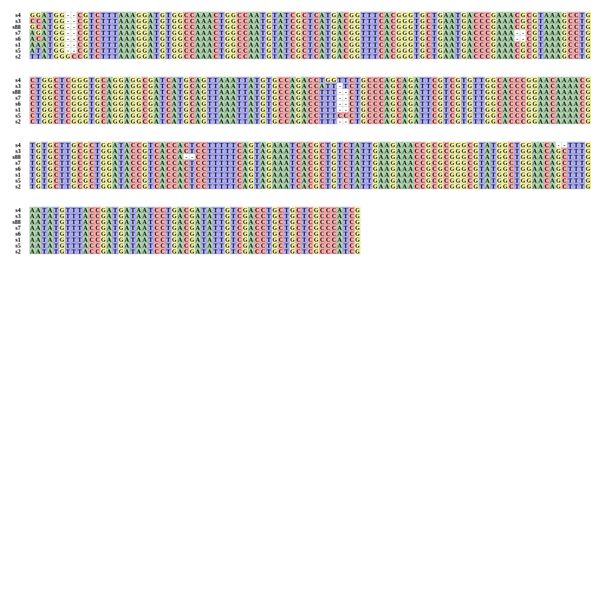

# pymsaploter
Usage: 
 cd example 
 cat demo.sh 

 

## Online explore msa by plotlyjs in a single html page file at https://orangesi.github.io/pymsaploter/

TODO: 
  1.add consensus sequence in buttom of fragments 
  2.add start position for every line  
